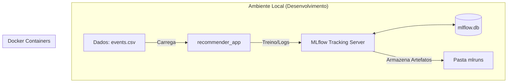

# 🚀 Sistema de Recomendação: Neural-NeuMF-MLP

Bem-vindo ao repositório do projeto **Tech Challenge**. Este sistema utiliza **Neural Collaborative Filtering (NeuMF)** para entregar recomendações personalizadas baseadas no comportamento de navegação da plataforma RetailRocket.

---

## 🏗️ Arquitetura do Sistema

O sistema é orquestrado via Docker, separando o ambiente de processamento (Aplicação) do ambiente de rastreamento (MLflow).


---

## 📂 Organização do Repositório

```text
├── shared/             # 🛠️ Utilitários, Preprocessamento e Factory de modelos
├── training/           # 🧠 Scripts de treino e lógica de ciclo de vida (train.py)
├── notebooks/          # 📊 Análise Exploratória (EDA)
├── docker-compose.yml  # 🐳 Orquestração de containers (App + MLflow)
├── README.md           # 📝 Documentação do projeto
└── mlruns/             # 💾 Persistência de experimentos (Docker Volume)

```

---

## ⚡ Guia de Execução

### 1. Subir o Ambiente

Certifique-se de ter o Docker instalado e rode na raiz:

```bash
docker-compose up -d --build
```

### 2. Executar o Treino

Para treinar o modelo e registrar os logs no MLflow automaticamente:

```bash
docker-compose exec recommender_app python training/train.py
```

### 3. Visualizar Experimentos

Abra o seu navegador e acesse: `http://localhost:5000` 🌐
---

## 🧪 Qualidade e Monitoramento

* **Monitoramento:** Utilizamos o **MLflow** para versionar métricas (`Precision`, `Recall`, `NDCG`) e artefatos (`modelo-neumf`).
* **Qualidade de Dados:** O sistema utiliza `infer_signature` para garantir que o contrato de entrada do modelo seja respeitado em produção.
* **Formatos de Serialização:** Utilizamos o formato `pt2` (TorchScript) para alta performance em inferência.

---

## 📈 Funcionalidades

* **Cold-Start Management:** Tratamento de índices de usuários e itens.
* **NeuMF Architecture:** Combinação de GMF e MLP para capturar interações lineares e não-lineares.
* **Lineage Tracking:** Rastreabilidade completa desde o dataset original até o modelo final.

---

## 🎯 Próximos Passos (Produção)

Para colocar o modelo em modo de servimento (API REST):

1. Registre o modelo no *Model Registry*.
2. Utilize o comando:
```bash
mlflow models serve -m "models:/Neural-NeuMF-MLP/Production" --port 5001
```


3. O endpoint estará disponível para requisições `POST` em `/invocations`.
---

> *"Um bom modelo de recomendação não é apenas aquele que acerta, mas aquele que você consegue reproduzir e auditar."* 🧠✨
