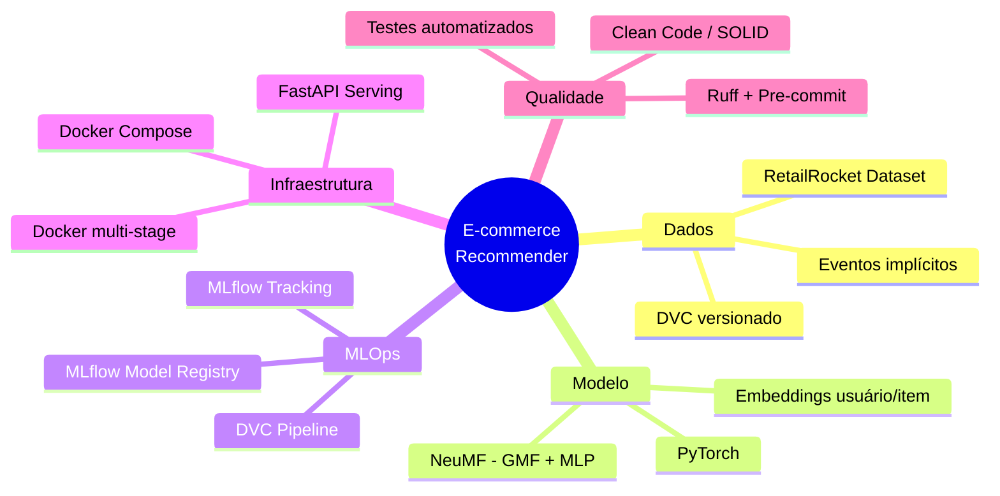
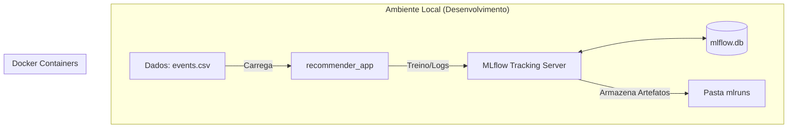
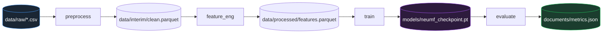
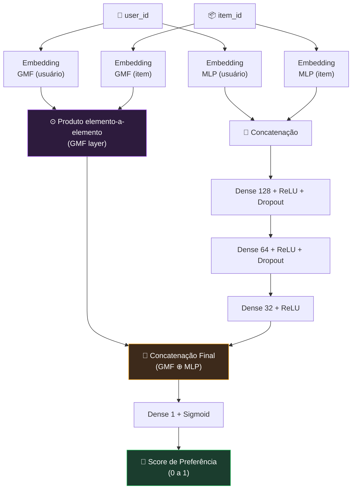

<div align="center">

# 🛒 E-Commerce Recommendation Engine

### Sistema de Recomendação de Produtos com Deep Learning, MLOps e Deploy em Produção

*Tech Challenge — Fase 02 | Pós Tech — Machine Learning Engineering*

[](https://www.python.org/)
[](https://pytorch.org/)
[](https://scikit-learn.org/)
[](https://mlflow.org/)
[](https://dvc.org/)
[](https://fastapi.tiangolo.com/)
[](https://www.docker.com/)
[](https://github.com/astral-sh/uv)
[](https://docs.astral.sh/ruff/)
[](#-licença)
[](#)

</div>

---
## 📖 Introdução

Este repositório implementa um **sistema de recomendação de produtos para e-commerce**
de ponta a ponta — desde a ingestão e versionamento dos dados brutos até o deploy de um
modelo de deep learning servido via API REST — seguindo práticas profissionais de
**Clean Code**, **MLOps** e **engenharia de software**.

O projeto foi desenvolvido como entrega do **Tech Challenge — Fase 02** da Pós Tech,
integrando os conhecimentos das disciplinas de Clean Code, Gerenciamento de Dependências,
Docker e DVC + MLflow.

O problema de negócio simulado é o de uma empresa de e-commerce que deseja recomendar
produtos relevantes a partir do **comportamento de navegação dos usuários** (visualizações,
adições ao carrinho e transações), sem depender de avaliações explícitas — um cenário
clássico de **feedback implícito**.

---

## 🎯 Objetivos

| Objetivo | Descrição |
|---|---|
| **Técnico** | Treinar uma rede neural (NeuMF — Neural Matrix Factorization) capaz de prever a probabilidade de interação usuário-item a partir de eventos implícitos. |
| **Engenharia** | Aplicar Clean Code, SOLID e Design Patterns em um pipeline de ML de produção. |
| **Reprodutibilidade** | Garantir que qualquer pessoa consiga reproduzir o ambiente e os resultados com `uv sync` + `dvc repro`. |
| **Rastreabilidade** | Versionar dados (DVC) e experimentos (MLflow), com promoção controlada de modelos (Staging → Production). |
| **Operação** | Containerizar toda a solução (treino + API) com Docker multi-stage e orquestração via Docker Compose. |
| **Entrega** | Expor o modelo em produção através de uma API REST documentada (FastAPI + Swagger). |

---

## 🔎 Visão Geral



O sistema é dividido em três grandes blocos que conversam entre si através de
artefatos versionados (dados no DVC, modelos no MLflow Registry):

1. **Camada de Dados** — ingestão, limpeza e engenharia de features do dataset RetailRocket, orquestrada como pipeline DVC.
2. **Camada de Treinamento** — treino do modelo NeuMF em PyTorch, comparação com baselines Scikit-Learn, tudo rastreado no MLflow.
3. **Camada de Serviço** — API FastAPI que carrega o modelo em `Production` no MLflow Registry e serve recomendações em tempo real.

---

## 🏗️ Arquitetura do Sistema

O sistema é orquestrado via Docker, separando o ambiente de processamento (Aplicação) do ambiente de rastreamento (MLflow).


---

## 📁 Estrutura do Projeto

```
projeto-tech-challenge/
├── api/                          # Camada de serviço (FastAPI)
│   ├── app.py                    # Entrypoint da API, definição de rotas
│   ├── schema.py                 # Modelos Pydantic (request/response)
│   └── service_wrapper.py        # Carrega modelo do MLflow Registry e executa inferência
│
├── configs/                      # Configurações (Pydantic Settings + YAML)
│   ├── model_config.yaml         # Hiperparâmetros do NeuMF
│   ├── training_config.yaml      # Épocas, batch size, learning rate, seed
│   └── logging_config.yaml
│
├── data/
│
├── documents/                    # Model Card, relatórios, EDA exportada
│
├── mlflow_data/                  # Backend store / artifact store local do MLflow
│
├── models/                       # Checkpoints locais (gitignored, versionados via DVC)
│
├── notebooks/                    # Exploração de dados (EDA), prototipagem
│
├── scripts/                      # Scripts utilitários
│   └── validate_env.py           # Validação do ambiente (deps, GPU, variáveis .env)
│
├── shared/                       # Código compartilhado entre training/ e api/
|   ├── data/                     # dados e pre proccessametno
│   ├── ml/                       # Factory Pattern: criação de modelos e otimizadores
        ├── models.py             # Definição da arquitetura NeuMF  e baselines (nn.Module)
        ├── baselines.py          # Definição da arquiteura de modelos de baselines
        ├── evaluate_metrics.py   # modulo para avaliação de modelos
        ├── model_factory.py      # factory para os modelos
    |── utils/
        ├── config.py             # configurações de ambiente
|
├── tests/                        # Testes unitários e de integração (pytest)
│   ├── test_preprocess.py
│   ├── test_model.py
│   ├── test_api.py
│   └── test_factories.py
│
├── training/                     # Pipeline de treinamento
│   ├── train.py                  # Treinamento rede neural
|   ├── train_baselines.py        # Treinamento de baselines
│
├── .dockerignore
├── .dvcignore
├── .env                          # Variáveis de ambiente (local, não commitado)
├── .env.example                  # Template de variáveis de ambiente
├── .gitignore
├── .pre-commit-config.yaml       # Hooks: ruff, ruff-format, trailing-whitespace
├── docker-compose.yml            # Orquestra api + mlflow server
├── dockerfile                    # Multi-stage build (builder + runtime)
├── dvc.lock                      # Lock file gerado pelo DVC
├── dvc.yaml                      # Definição do pipeline (4 stages)
├── main.py                       # Entrypoint alternativo (CLI de treino/inferência)
├── pyproject.toml                # Dependências (uv), metadados, config do ruff
├── README.md                     # Este arquivo
├── ruff.toml                     # Configuração do linter
└── uv.lock                       # Lock file de dependências (uv)
```
---

---

## 🛠 Instalação
### Pré-requisitos
- Python **3.11+**
- [`uv`](https://github.com/astral-sh/uv) para gerenciamento de dependências
- Docker e Docker Compose (opcional, mas recomendado)
- Git e [DVC](https://dvc.org/) (`pip install dvc` ou via `uv`)

### 1. Clonar o repositório
```bash
git clone https://github.com/<seu-usuario>/projeto-tech-challenge.git
cd projeto-tech-challenge
```

### 2. Instalar dependências com uv

```bash
uv sync
```
Isso cria um `.venv` local e instala exatamente as versões travadas em `uv.lock`,
garantindo reprodutibilidade entre máquinas.

Ativar o ambiente:

```bash
source .venv/bin/activate      # Linux / macOS
.venv\Scripts\activate         # Windows
```

### 4. Validar o ambiente

```bash
python scripts/validate_env.py
```

Esse script confere: versão do Python, disponibilidade de GPU (CUDA/MPS), presença das
variáveis obrigatórias do `.env` e conectividade com o MLflow Tracking Server.

### 5. Instalar hooks de pre-commit

```bash
pre-commit install
```

### 6. Rodar os testes

```bash
pytest -v --cov=shared --cov=api --cov=training
```

---

## 🐳 Docker
O projeto utiliza um **Dockerfile multi-stage** para separar as dependências de build
(compiladores, wheels do PyTorch) da imagem final de runtime, reduzindo
significativamente o tamanho da imagem publicada.

### Build da imagem
```bash
docker-compose build
```

### Subir com Docker Compose
O `docker-compose.yml` orquestra dois serviços: a **API de recomendação** e o
**MLflow Tracking Server**.

```bash
docker-compose up --build
```

| Serviço | Porta | Descrição |
|---|---|---|
| `api` | `8000` | API FastAPI servindo o modelo `Production` |
| `mlflow` | `5000` | UI e backend de tracking do MLflow |

---

## 🗃 DVC — Versionamento de Dados

O pipeline de dados é definido em `dvc.yaml` com **4 estágios encadeados**, cada um
consumindo a saída do anterior — garantindo reprodutibilidade total via `dvc repro`.



### Comandos essenciais

```bash
dvc init                          # inicializa o DVC no repositório
dvc remote add -d storage ./data/dvc-storage   # configura remote local (ou S3)
dvc add data/raw                  # versiona os dados brutos
dvc repro                         # executa o pipeline completo, respeitando o cache
dvc dag                           # visualiza o grafo de dependências
dvc push                          # envia dados/artefatos para o remote
dvc pull                          # baixa dados/artefatos versionados
```

---

## 📊 MLflow — Tracking e Registry

Todo run de treinamento loga automaticamente:
- **Parâmetros**: `learning_rate`, `embedding_dim`, `batch_size`, `epochs`, `seed`, arquitetura das camadas MLP.
- **Métricas por época**: `train_loss`, `val_loss`, `HR@10`, `NDCG@10`, `precision@10`, `recall@10`.
- **Artefatos**: checkpoint do modelo, curva de treino (PNG), matriz de confusão de classificação implícita, `Model Card` em Markdown.

```bash
# Subir a UI localmente
mlflow ui --backend-store-uri sqlite:///mlflow_data/mlflow.db --port 5000
```

```python
# training/train.py (trecho ilustrativo)
import mlflow

mlflow.set_tracking_uri("http://localhost:5000")
mlflow.set_experiment("neumf-recommender")

with mlflow.start_run(run_name="neumf-v1"):
    mlflow.log_params(config.model_dump())
    for epoch in range(config.epochs):
        ...
        mlflow.log_metrics({"train_loss": loss, "val_hr@10": hr}, step=epoch)
    mlflow.pytorch.log_model(model, artifact_path="model",
                              registered_model_name="neumf-recommender")
```

### 3. Visualizar Experimentos
Abra o seu navegador e acesse: `http://localhost:5000` 🌐
---

## 🧪 Qualidade e Monitoramento

* **Monitoramento:** Utilizamos o **MLflow** para versionar métricas (`Precision`, `Recall`, `NDCG`) e artefatos (`modelo-neumf`).
* **Qualidade de Dados:** O sistema utiliza `infer_signature` para garantir que o contrato de entrada do modelo seja respeitado em produção.
* **Formatos de Serialização:** Utilizamos o formato `pt2` (TorchScript) para alta performance em inferência.

---

## 🛍 Dataset RetailRocket
Fonte: [Kaggle — RetailRocket Recommender System Dataset](https://www.kaggle.com/datasets/retailrocket/ecommerce-dataset)
Dados reais e anonimizados de comportamento de usuários coletados por 4,5 meses em um
site de e-commerce russo. Composto por três arquivos:

| Arquivo | Conteúdo | Volume aproximado |
|---|---|---|
| `events.csv` | Eventos de `view`, `addtocart` e `transaction` com `visitorid`, `itemid`, `timestamp`, `transactionid` | ~2,7 milhões de eventos |
| `item_properties.csv` (parte 1 e 2) | Propriedades de itens variando no tempo (categoria, preço, disponibilidade) | ~20 milhões de registros |
| `category_tree.csv` | Hierarquia de categorias de produtos | ~1.700 categorias |

**Estatísticas relevantes:**
- ~1,4 milhão de visitantes únicos
- ~235 mil itens únicos
- Taxa de conversão `view → transaction` extremamente baixa (~1,2%), típica de cenários de e-commerce real — reforçando a necessidade de **feedback implícito** e amostragem negativa.

## 🧠 Arquitetura do Modelo — NeuMF (Model Card)
### Visão geral da arquitetura
O modelo implementado é o **NeuMF (Neural Matrix Factorization)**, proposto por He et
al. (2017), que combina duas sub-redes complementares:
- **GMF (Generalized Matrix Factorization)** — generalização do produto interno clássico de fatoração de matrizes, capturando interações lineares.
- **MLP (Multi-Layer Perceptron)** — captura interações não-lineares de alta ordem entre embeddings de usuário e item.



### Iniciando a API localmente
```bash
uvicorn api.app:app --host 0.0.0.0 --port 8000 --reload
```

### Via Docker Compose
```bash
docker compose exec recommender_app python -m uvicorn api.app:app --host 0.0.0.0 --port 8000 --reload
```

---

## 🔌 Endpoints

| Método | Rota | Descrição |
|---|---|---|
| `GET` | `/health` | retorna o Health check da aplicação |
| `GET` | `/recommend/{visitor_id}` | retorna a recomendação de 10 produtos de um visitor_id especifico |
| `GET` | `/recommend/list/all` | retorna todos os visitor_id e os produtos recomendados |

---

## 📘 Swagger / OpenAPI
A documentação interativa é gerada automaticamente pelo FastAPI e disponibilizada em:
```
http://localhost:8000/docs      # Swagger UI
http://localhost:8000/redoc     # ReDoc
```
Todos os schemas de request/response são derivados diretamente das classes Pydantic
em `api/schema.py`, garantindo que a documentação nunca fique dessincronizada do
código.
---

## 📮 Exemplos de Requisição
### Recomendação para um usuário

```bash
http://localhost:8000/recommend/51
```
**Resposta:**
```json
{"visitorid":51,"recommendations":[28349,68844,16140,37734,16130,80934,51574,15488,65076,3743]}
```

### all visitor
```bash
http://localhost:8000/recommend/list/all
```
**Resposta:**
```json
{"visitorid":51,"recommendations":[28349,68844,16140,37734,16130,80934,51574,15488,65076,3743], .......}
```

### Health check
```bash
http://localhost:8000/health
```
**Resposta:**
```json
{"status":"ok","message":"modelo rodando com sucesso"}
```
---

## ⚡ Inferência

O `service_wrapper.py` mantém o modelo carregado **em memória** durante todo o ciclo
de vida do processo (carregado uma única vez no evento de `startup` do FastAPI),
evitando a latência de recarregar pesos do MLflow a cada requisição.
---

## 📈 Avaliação e Métricas

O modelo é avaliado com métricas padrão de sistemas de recomendação top-N,
calculadas sobre o conjunto de teste (última interação de cada usuário, protocolo
leave-one-out):

| Métrica | Definição |
|---|---|
| **HR@K (Hit Ratio)** | Proporção de usuários cujo item de teste aparece no top-K recomendado |
| **NDCG@K** | Normalized Discounted Cumulative Gain — pondera a posição do acerto no ranking |
| **Precision@K** | Proporção de itens relevantes entre os top-K recomendados |
| **Recall@K** | Proporção de itens relevantes recuperados dentre todos os relevantes possíveis |

Essas 4 métricas atendem ao requisito de **comparação com baselines usando ≥ 4
métricas**.

---

**Trade-offs observados:**
- O NeuMF tem custo de treino significativamente maior que os baselines (necessidade de GPU para tempos de treino razoáveis).
- O ganho de métrica é mais expressivo para usuários com histórico moderado a longo; usuários com 1-2 interações (cold-start) se beneficiam pouco do componente de deep learning, reforçando a necessidade do fallback de popularidade.

---

## ⚠️ Limitações

- **Cold-start**: usuários e itens novos, sem histórico de interação, não possuem embeddings aprendidos — mitigado com fallback de popularidade, mas ainda é uma limitação estrutural do Collaborative Filtering.
- **Viés de popularidade**: itens populares tendem a ser super-representados na amostragem negativa e nas recomendações, podendo reduzir a diversidade do catálogo exposto.
- **Ausência de contexto temporal fino**: o modelo atual não modela explicitamente sequência/sessão (não é um modelo sequencial como GRU4Rec ou SASRec).
- **Escala**: o treino foi validado em um subconjunto do dataset completo; treinar com os ~2,7 milhões de eventos completos requer infraestrutura com GPU dedicada.
- **Dados sintéticos de preço/categoria**: parte das `item_properties` do RetailRocket é hasheada/anonimizada, limitando a interpretabilidade de algumas features.
---
